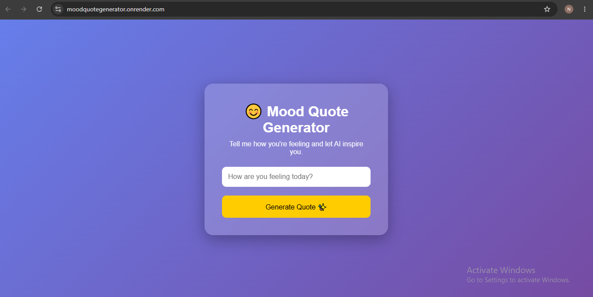

# Mood Quote Generator

## 🌐 Live Demo
https://moodquotegenerator.onrender.com

A simple web application that displays motivational quotes based on the user's mood.

## 📷 Screenshot



## Problem Statement

People often need a quick motivational message when they are feeling low, stressed, or even happy.

## Solution

Users select a mood and receive an instant motivational quote.

## Features

- Mood Selection
- Quote Generator
- Clean UI
- Fast Response

## Tech Stack

- Python
- Flask
- HTML
- CSS

## Project Structure

MoodQuoteGenerator/
│
├── app.py
├── README.md
├── requirements.txt
├── templates/
├── static/

## Installation

```bash
pip install -r requirements.txt
```

## Run

```bash
python app.py
```

## Author

Nikhil Srivastava